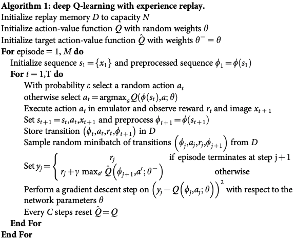

# A summary of RL algorithms
In this repo, I will implement some key algorithms in RL that discussed in [my blog](https://guoqq17.github.io/)

## 1. Deep Q-Learning

### 1.1 Original Deep Q-Networks (DQN, [Mnih et al. (2015)](https://storage.googleapis.com/deepmind-data/assets/papers/DeepMindNature14236Paper.pdf))

  

- [Fully connected DQN](main.py)
